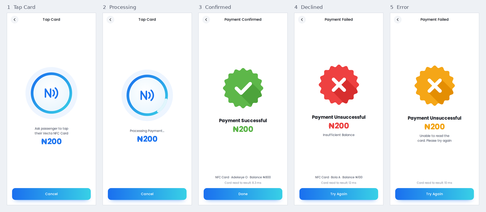

# Vecta Tap Test

A feasibility test for Vecta: can an ordinary phone replace the ₦189,000 POS terminal as the
fare terminal, and how fast is a tap? Open the app on a phone, tap a Vecta NFC card
(NTAG 424 DNA), and it charges a test fare from a test balance and records how long the tap took.
The admin dashboard for adding test cards and loading balances is inside the same app.



## Quick start

1. Put this folder online on an `https://` address (see [docs/SETUP.md](docs/SETUP.md), step 1).
2. **Android:** open the address in Chrome, tap **Admin → Add test card**, keep **Quick token**,
   press **Continue** and hold a card on the back of the phone. Then **Open terminal** and tap the card.
3. **iPhone:** open the address in a Safari tab, tap **Open terminal**, hold the card at the top of
   the phone and tap the notification. The payment shows in the tab that opens.
4. Read the numbers in **Admin → Results**, or export them as CSV.

For the full measurement plan, see [docs/TEST-PROTOCOL.md](docs/TEST-PROTOCOL.md).

## How it works on each phone

|                        | Android (Chrome, Samsung Internet)            | iPhone (Safari)                                        |
|------------------------|-----------------------------------------------|--------------------------------------------------------|
| Who reads the card     | The app itself, through Web NFC               | iOS reads the link on the card and shows a notification |
| Touches per payment    | One: the card                                 | Two: the card, then the notification                   |
| Where the result shows | The same screen                               | A new Safari tab                                       |
| What the app can time  | Card read to result on screen                 | Link opened to result; film the rest with a second phone |
| Can write cards        | Yes, in the same touch as reading             | No, use NXP TagWriter                                  |

## Three kinds of test card

- **Quick token:** the app writes a link with a random token onto the card. Fastest to set up; the link can be copied onto another card, which the app catches on Android by comparing chip IDs.
- **Secure link (SUN):** the NTAG 424 DNA signs every tap with AES. Each tap carries a counter, so a copied or replayed link is refused. Needs one-time setup with NXP TagWriter.
- **Card ID only:** uses the chip's serial number. Android only and the easiest to fake; useful with any NFC card.

## Files

```
index.html              app page
manifest.webmanifest    install details (name, icons)
sw.js                   offline cache; change VERSION when you upload new files
css/app.css             all styling
js/app.js               start-up, screens, taps that arrive as links (iPhone)
js/terminal.js          the Tap Card / Processing / result screens
js/admin.js             Cards, Results and Settings
js/pay.js               payment decision and timing log
js/nfc.js               Web NFC reader and writer (Android)
js/sun.js               NTAG 424 DNA SUN check (AES-CMAC, NXP AN12196)
js/store.js             test data saved in the browser
js/ui.js                shared helpers and graphics
fonts/, icons/          Poppins (with a drawn ₦ sign) and app icons
tests/sun.test.mjs      crypto tests: run  node tests/sun.test.mjs
docs/                   setup guide, test protocol, screenshots
```

## Test only

Balances, cards and the tap log live in the browser on each phone, and there is no server.
That is right for a feasibility test and wrong for real money. New NTAG 424 DNA cards use
all-zero keys, so anyone could forge a tap until the keys are changed on the cards and in
Settings. The real system keeps the keys and the ledger on the server side.
